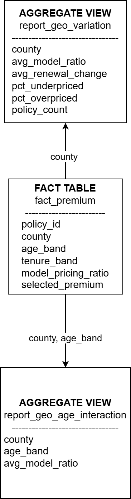

# Insurance Premium Pricing Diagnostic

An end-to-end analytics project investigating structural pricing dispersion in an auto insurance portfolio.

The analysis identifies lifecycle and geographic interaction effects driving systematic deviation from modeled pricing indications.

---

## Executive Dashboard

The dashboard highlights:

• Portfolio pricing trends vs model indication  
• Interaction effects across geography and lifecycle  
• Segment-level dispersion drivers  
• Strategic calibration insights

---

## Lifecycle Effects

Pricing deviation increases across age bands and is amplified by tenure effects, suggesting lifecycle calibration drift.

---

## Geographic Pricing Behavior

County-level pricing behavior reveals regional clustering and localized pricing divergence.

---

## Geo × Age Interaction Effects

Interaction dispersion materially exceeds standalone driver strength, indicating structural segmentation imbalance.

---

# Data Model

The analysis uses a simplified dimensional model designed for pricing diagnostics.

Key tables:

**fact_premium**

• policy_id  
• county  
• age_band  
• tenure_band  
• model_pricing_ratio  

**report_geo_variation**

Aggregated geographic pricing diagnostics.

**report_geo_age_interaction**

Segment-level interaction effects across geography and lifecycle segments.

---

# Pipeline Overview
Raw Insurance Data
│
▼
Python ETL Pipeline
(pandas transformation)
│
▼
SQLite Analytical Database
│
▼
SQL Analytical Queries
│
▼
Power BI Dashboard

---

# Key Insights

• Interaction effects dominate pricing dispersion  
• Older short-tenure segments show systematic underpricing  
• Younger long-tenure segments trend below model indication  
• Geographic clustering reinforces lifecycle imbalance  

Observed Geo × Age dispersion exceeds **35%**, suggesting structural calibration drift.

---

# Tech Stack

Python (pandas, numpy)  
SQLite  
SQL  
Power BI  
Git / GitHub

---

# Project Structure
insurance-pricing-diagnostic
│
├── data
│ ├── raw
│ └── processed
│
├── notebooks
│ └── insurance_data_ETL.py
│
├── sql
│ └── analysis_queries.sql
│
├── powerbi
│ └── pricing_dashboard.pbix
│
├── outputs
│ ├── screenshots
│ └── diagrams
│
├── run_pipeline.py
└── README.md

---

# Reproducing the Analysis

Install dependencies:
pip install -r requirements.txt

Run the ETL pipeline:
insurance_data_ETL.py

This prepares the analytical dataset used by the SQL queries and Power BI dashboard.

---

# Author

Independent analytics project exploring pricing model adherence diagnostics in insurance portfolios.